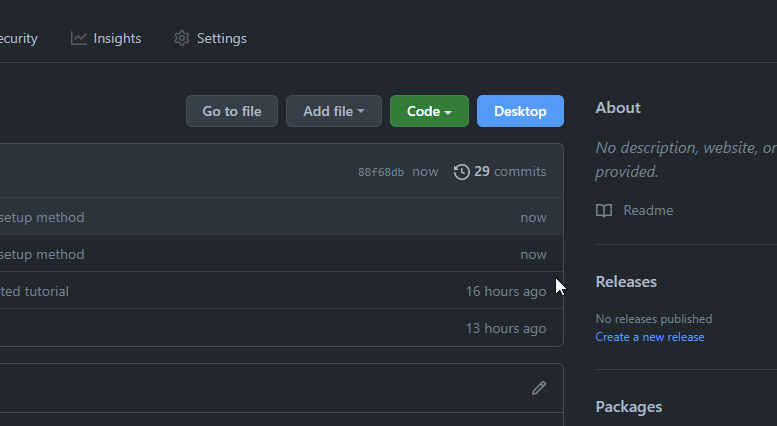

# Убирает ограничение на воспроизведение в фоне на 30 минут. Хорошо сочетается с блокировщиками рекламы типа Adguard.

## Инструкция
1. Клонируем репозиторий
  

  

  
2. Переходим на [chrome://extensions](chrome://extensions), включаем режим разработчика и добавляем папку extension как распакованное расширение
  


## Инструкция (через стороннее расширение)
Инструкция если у вас Firefox. В нём не работает моё расширение
  
1. Устанавливаем расширение [Requestly](https://chrome.google.com/webstore/detail/requestly-redirect-url-mo/mdnleldcmiljblolnjhpnblkcekpdkpa)
  

2. Создаём следующие правила:
  

  

  

  

  
Скопировать:
```
Content-Security-Policy
```

```
default-src * 'unsafe-inline' 'unsafe-eval'; script-src * 'unsafe-inline' 'unsafe-eval'; connect-src * 'unsafe-inline'; img-src * data: blob: 'unsafe-inline'; frame-src *; style-src * 'unsafe-inline';
```

```
content-type
```

```
text/javascript
```

```
https://raw.githubusercontent.com/AriesAlex/yandex-music-30min-remover/master/index.js
```

```
https://music.yandex.ru/index.js
```
## Fiddler
Есть готовое правило для прокси-сервера Fiddler - **fiddler.farx**