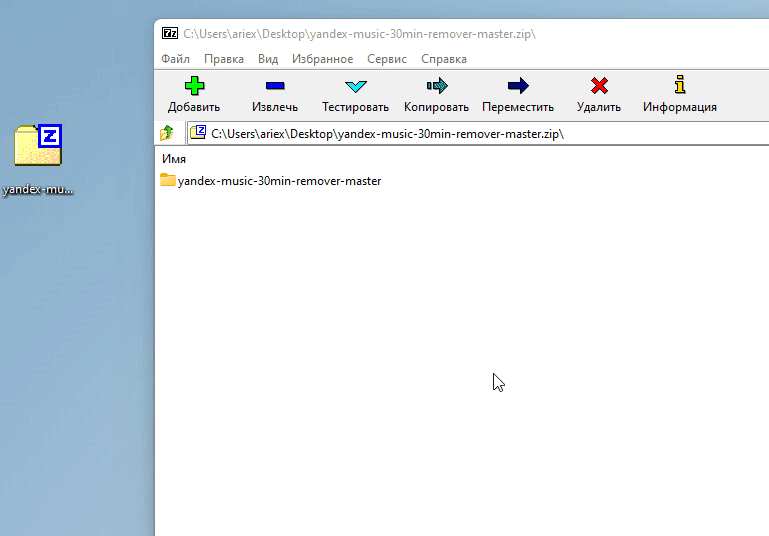

# Убирает ограничение на воспроизведение в фоне на 30 минут. Хорошо сочетается с блокировщиками рекламы типа Adguard.

## Инструкция
1. Скачиваем скрипт
  

2. Помещаем на раб. стол
  

3. Переопределяем для сайта в браузере
  

## Примечание
Скрипт может стать неактуальным с выходом новой версии Яндекс Музыки
Можете попробовать переименовать скрипт, поменяв версию на актуальную
Посмотреть ее можно здесь:

## Fiddler
Есть готовое правило для прокси-сервера Fiddler - **fiddler.farx**